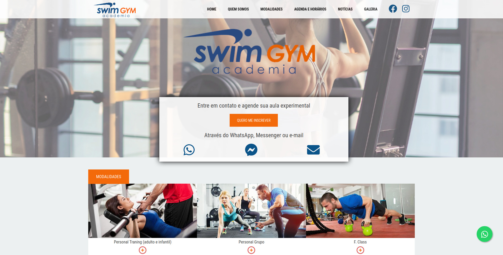

## Swimgym

[](https://app.netlify.com/sites/swimgym/deploys)

A simple Gatsby website made for Academia Swimgym



## Requirements

* Node Version Manager (v0.38.0)
* NPM 7.17.0
* Gatsby CLI 3.7.1

## Running the project

1. Clone this repository

```sh
git clone https://github.com/eccjr/swimgym.git
cd swimgym

```
2. Change to the right version of node

```sh
nvm use
```

3. Install the dependencies

```sh
npm install
```

4. Start the project

```sh
npm run start
```
